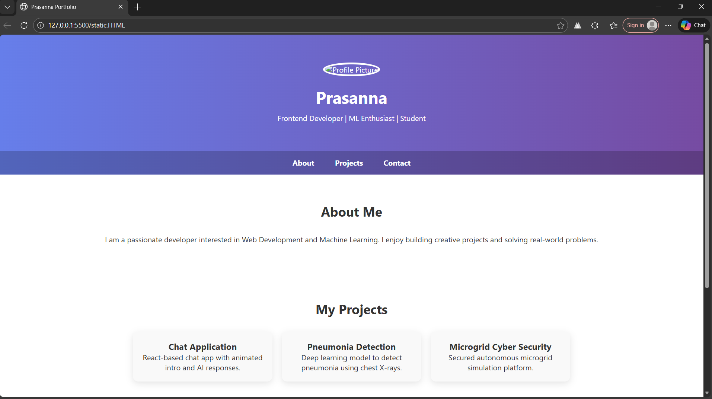

# Ex01 Portfolio
## Date:02.02.2026

## AIM
To create a Portfolio using HTML and CSS.

## ALGORITHM
### STEP 1
Create an HTML file (index.html)

### STEP 2
Create a CSS file (style.css)

### STEP 3
Include a navigation bar with links to different sections.

### STEP 4
Add structured sections for introduction, about, projects, and contact details.

### STEP 5
Define global styles for fonts, colors, and layout.

### STEP 6
Style the header, navigation bar, and sections.

### STEP 7
Use Flexbox or CSS Grid for layout design.

### STEP 8
Add hover effects and transitions for interactivity.

### STEP 9
Add Images and Media.

### STEP 10
Use optimized images for a professional look.

### STEP 11
Open the HTML file in a browser to check layout and functionality.

### STEP 12
Fix styling issues and refine content placement.

### STEP 13
Deploy the Portfolio.

### STEP 14
Upload to GitHub Pages for free hosting.

## PROGRAM
Static.html
```
<!DOCTYPE html>
<html>
<head>
    <title>Prasanna Portfolio</title>
    <meta name="viewport" content="width=device-width, initial-scale=1.0">
    
    <!-- Link CSS File -->
    <link rel="stylesheet" href="style.css">
</head>

<body>

    <header>
        
        <h1>Prasanna</h1>
        <p>Frontend Developer | ML Enthusiast | Student</p>
    </header>

    <nav>
        <a href="#about">About</a>
        <a href="#projects">Projects</a>
        <a href="#contact">Contact</a>
    </nav>

    <section id="about">
        <h2>About Me</h2>
        <p>
            I am a passionate developer interested in Web Development and Machine Learning.
            I enjoy building creative projects and solving real-world problems.
        </p>
    </section>

    <section id="projects">
        <h2>My Projects</h2>

        <div class="projects-container">
            <div class="project-card">
                <h3>Chat Application</h3>
                <p>React-based chat app with animated intro and AI responses.</p>
            </div>

            <div class="project-card">
                <h3>Pneumonia Detection</h3>
                <p>Deep learning model to detect pneumonia using chest X-rays.</p>
            </div>

            <div class="project-card">
                <h3>Microgrid Cyber Security</h3>
                <p>Secured autonomous microgrid simulation platform.</p>
            </div>
        </div>
    </section>

    <section id="contact" class="contact">
        <h2>Contact Me</h2>
        <p>Email: teju@example.com</p>
        <p>LinkedIn: linkedin.com/in/teju</p>
    </section>

    <footer>
        <p>© 2026 Prasanna | All Rights Reserved</p>
    </footer>

</body>
</html>
```
style.css
```
* {
    margin: 0;
    padding: 0;
    box-sizing: border-box;
}

body {
    font-family: 'Segoe UI', sans-serif;
    background: linear-gradient(to right, #667eea, #764ba2);
    color: #333;
}

/* Header */
header {
    text-align: center;
    padding: 60px 20px;
    color: white;
}

header img {
    width: 150px;
    height: 150px;
    border-radius: 50%;
    border: 4px solid white;
    margin-bottom: 20px;
}

header h1 {
    font-size: 36px;
    margin-bottom: 10px;
}

/* Navigation */
nav {
    text-align: center;
    padding: 15px;
    background: rgba(0,0,0,0.2);
}

nav a {
    color: white;
    text-decoration: none;
    margin: 0 20px;
    font-weight: bold;
    transition: 0.3s;
}

nav a:hover {
    color: #ffd700;
}

/* Sections */
section {
    padding: 60px 20px;
    text-align: center;
    background: white;
}

h2 {
    margin-bottom: 30px;
    font-size: 28px;
}

/* Projects */
.projects-container {
    display: flex;
    justify-content: center;
    flex-wrap: wrap;
    gap: 20px;
}

.project-card {
    background: #f9f9f9;
    width: 300px;
    padding: 20px;
    border-radius: 12px;
    box-shadow: 0 5px 15px rgba(0,0,0,0.1);
    transition: transform 0.3s;
}

.project-card:hover {
    transform: translateY(-10px);
}

/* Contact */
.contact {
    background: #f4f4f4;
}

/* Footer */
footer {
    background: #222;
    color: white;
    text-align: center;
    padding: 20px;
}

/* Responsive */
@media (max-width: 768px) {
    .projects-container {
        flex-direction: column;
        align-items: center;
    }
}
```

## OUTPUT


## RESULT
The program for creating Portfolio using HTML and CSS is executed successfully.
